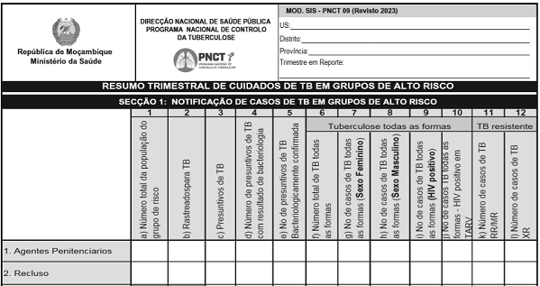

# Ficha de Resumo Trimestral de Cuidados de TB em Grupos de Alto Risco

O serviço foi criado de acordo com o modelo da Ficha de Resumo Trimestral de Cuidados de TB em Grupos de Alto Risco actualmente vigente no Serviço Nacional de Saúde em Moçambique e as células são interativas, isto é, pode inserir valores nelas.

## Propósito

* Expandir o acesso à Ficha de Resumo Trimestral de Cuidados de TB em Grupos de Alto Risco.

## O que eu preciso dispor para, e como utilizar o totalizador?

* Um celular ou computador com acesso à internet;

* Ter colhido os dados de todos os indicadores da ficha nas respectivas fontes primárias (livro(s) de registo) da sua Unidade Sanitária;

* E por fim, preencher os dados nas células correspondentes em função das variáveis (indicador, faixa etária e sexo).

## Qual é o destino dos dados que eu insiro?

São guardados no seu celular ou computador, por meio de um recurso chamado [Web Storage](https://developer.mozilla.org/pt-BR/docs/Web/API/Web_Storage_API) e você tem total controle sobre os dados, podendo mantê-los ou apagá-los por meio da opção "Esvaziar ficha" no cabeçalho da página ou excluindo os dados de navegação do seu navegador.

## Vantagens do serviço

* As células são interativas, ou seja, pode inserir valores nelas;;

* Flexibiliza a elaboração do resumo;

* Pode ser impresso, inclusive como uma simples ficha de resumo mensal;

* Pode ser guardado como PDF.

